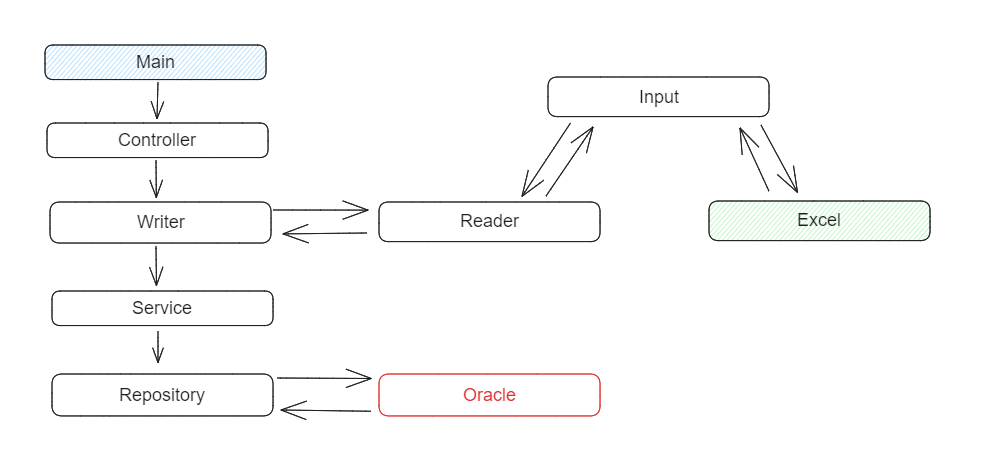

## :white_check_mark: Microsserviço Integrador de Planilhas

Sistema desenvolvido para realizar a leitura de arquivos .xlsx, converte-los em objetos e realizar a persistencia no banco de dados Oracle.

  

 
 

No projeto em questão, o microsserviço está rodando em Docker a cada 01 minuto com mapeamento de diretórios de rede ativo.  
As planilhas serão atualizadas na rede pelo usuário, e todos os dias em que houver novas alterações, os dados serão devidamente persistidos em banco. 

### :dart: Fluxograma Runtime

  

 
 
